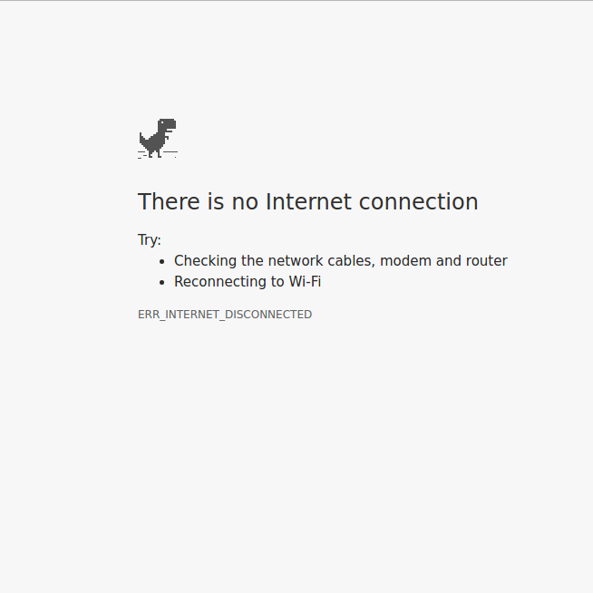

**HN-Angular2**
---------------
Creating clone of [Hacker News](https://news.ycombinator.com/) using Angular2 with other facilities like:  
* Registration/Login using GitHub
* Bookmark the stories
* Share directly using social media 
* Offline mode

### Registration/Login using GitHub
Registration/Login using GitHub, no need to register at this plateform.

### Bookmark a Story
 You will be allowed to bookmark a story which you liked. 

### Sharing
You can share the story using social media.

### Offline Mode
You will be able to get stories even in no internet connection or very poor internet connection if you visited the site already. It is provided using  [Service Worker](https://coryrylan.com/blog/fast-offline-angular-apps-with-service-workers).  
With offline mode facility if there is no internet connection/very poor connection you would not see dinosaur error.

